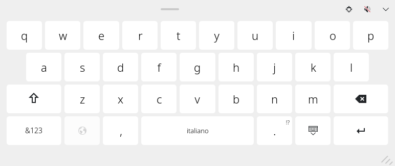

<!-- SPDX-FileCopyrightText: 2026 CC834 -->
<!-- SPDX-License-Identifier: CC0-1.0 -->

# Floating Plasma Keyboard

A small, movable touch keyboard for **KDE Plasma on Wayland**. Drag it where you need it, resize it with your finger, and keep typing into your app.



*Actual keyboard screenshot. Italian QWERTY layout shown; available languages depend on your Qt Virtual Keyboard installation.*

A community modification of [KDE Plasma Keyboard](https://invent.kde.org/plasma/plasma-keyboard), based on **v6.7.4**. This is an experimental fork, not an official KDE release.

## What it does

- Floats above your app without pushing its window upward.
- Moves using the top handle, with touch or mouse.
- Resizes from its edges and corners; keys adapt to the new shape.
- Remembers its size and offers compact/wide presets.
- Types without taking focus away from the text field.
- Provides soft key-click sounds and a speaker button to mute them.
- Hides with the down arrow and includes a launcher to show it manually.
- Stays available across virtual desktops with the included KWin rule.

## Requirements

This has been tested on **Fedora 44, Plasma 6.7.4–6.7.5, Qt 6.11.2, and Wayland**. Other versions and distributions have not been verified.

Install your distribution's **Plasma Keyboard** package first. This user installation reuses its Breeze keyboard style, QML components, layouts, and runtime dependencies. It also needs the **Qt Multimedia QML module** for clicks.

To build, you need CMake, Ninja, a C++20 compiler, and development packages for:

| Component | Minimum |
| --- | --- |
| Qt Core, Gui, Virtual Keyboard, Wayland Client and their required private headers | 6.10 |
| KDE Extra CMake Modules and Frameworks: CoreAddons, I18n, Config, Crash | 6.26 |
| Plasma Quick | 6.7 |
| libxkbcommon, Wayland, Wayland protocols | As required by CMake |

Qt Test and Qt Wayland Compositor are also needed for the tests. Package names vary by distribution. The optional settings module additionally needs KCMUtils.

## Build

```sh
git clone https://github.com/CC834/plasma-keyboard-floating.git
cd plasma-keyboard-floating
cmake -S . -B build -G Ninja \
  -DCMAKE_BUILD_TYPE=Release \
  -DBUILD_KCM=OFF \
  -DBUILD_TESTING=ON \
  -DPLASMA_KEYBOARD_SOUNDS_ENABLED=ON \
  -DPLASMA_KEYBOARD_VIBRATION_ENABLED=OFF
cmake --build build --target plasma-keyboard mockinputmethodcompositor
```

Use development packages matching your installed Qt libraries: this project uses Qt private APIs. Vibration is disabled in this configuration because it requires an additional feedback service.

## Install for your user

```sh
python3 tools/install-user.py build
```

The installer copies the executable and two launchers into your home directory. It does not replace the distribution's keyboard, select an input method, or change your existing window rules. Existing files it replaces are backed up outside the repository.

Then configure Plasma:

1. Open **System Settings → Window Management → Window Rules**. Import [`config/floating-keyboard.kwinrule`](config/floating-keyboard.kwinrule) and apply it. This rule keeps the keyboard above other windows, on all desktops, and prevents it stealing focus.
2. In System Settings, search for **Virtual Keyboard** and select **Floating Plasma Keyboard**.
3. Touch a text field. You can also search the application menu for **Show Floating Keyboard**.

Use the speaker button in the keyboard's top bar to enable clicks.

### If notification sounds are muted

Qt classifies sound effects as notifications. For a separate keyboard volume/mute setting, install the optional WirePlumber rule:

```sh
python3 tools/install-user.py build --with-audio-rule
```

Log out and back in to load the audio rule. It gives this keyboard its own remembered audio setting while preserving the mute setting for other notifications. The rule was tested with WirePlumber 0.5-style configuration; it is not intended for older Lua-based configurations.

If you previously muted the keyboard itself in Plasma's volume controls, unmute it there too.

## Using it

| Control | Action |
| --- | --- |
| Top handle | Move the keyboard |
| Outer edges and corners | Resize |
| Bottom-right grip | Resize with touch or mouse |
| Size button | Switch between compact and wide |
| Speaker button | Enable or mute key clicks |
| Down arrow | Hide |
| Show Floating Keyboard launcher | Open manually in the current app |

## Known limitations

- **Automatic appearance depends on the app.** Some XWayland apps and custom text fields do not expose the Wayland text-input support Plasma needs. Use the manual launcher when necessary; compatibility still depends on the app and compositor.
- This is a **floating keyboard**, not a complete recreation of the Windows touch keyboard. Docking, split layouts, and Windows-style animations are not implemented.
- Long-press accent overlays retain Plasma's original input-panel integration. Touch behavior and screen scaling may differ across devices.
- Keyboard clicks use the bundled KDE/Canonical sound asset, not an iPhone recording.
- The KWin rule matches Plasma Keyboard's application ID, which is shared with the stock keyboard. Disable or remove that rule when switching back to stock.

## Tests

```sh
QT_QPA_PLATFORM=offscreen dbus-run-session -- build/bin/mockinputmethodcompositor
```

The mock Wayland compositor checks typing without compositor keyboard focus, touch/mouse resizing, moving, hiding/showing, size presets, and accent composition.

The optional audio test is skipped by default. It requires an **isolated output sink**, the test keyboard routed to that sink, and `FLOATING_KEYBOARD_AUDIO_MONITOR` set to that sink's monitor. Never point it at a microphone. Setting `PULSE_SINK` alone is insufficient on some Qt backends.

During local validation, the full suite passed **9 checks**, including captured PCM audio from mouse/touch key taps and silence when muted. Those are local test results, not a promise of compatibility with every Plasma setup.

## Return to the stock keyboard

Select the distribution's keyboard in System Settings and remove the **Floating Plasma Keyboard** window rule. Then remove these custom files if you no longer want them:

```sh
rm -- ~/.local/libexec/plasma-keyboard-floating \
  ~/.local/libexec/show-floating-keyboard \
  ~/.local/share/applications/org.kde.plasma.keyboard-floating.desktop \
  ~/.local/share/applications/org.kde.plasma.keyboard-floating-show.desktop
```

If installed, remove `~/.config/wireplumber/wireplumber.conf.d/80-floating-keyboard.conf` and log out and back in. Settings shared with the stock keyboard are kept. Installer backups are under `~/.local/state/plasma-keyboard-floating/backups/`.

## Credits and licensing

Based on KDE Plasma Keyboard by its [upstream contributors](https://invent.kde.org/plasma/plasma-keyboard). The Qt Virtual Keyboard layouts and inherited files retain their original attribution and license notices. The bundled click is credited to **Canonical Ltd. (2013)** and is **GPL-3.0-only**.

See [`LICENSE`](LICENSE), [`LICENSES/`](LICENSES/), and each file's SPDX notices. The sound-enabled configuration includes GPLv3-only material. This repository preserves the upstream license files and attribution; it is not affiliated with Microsoft or Apple.
